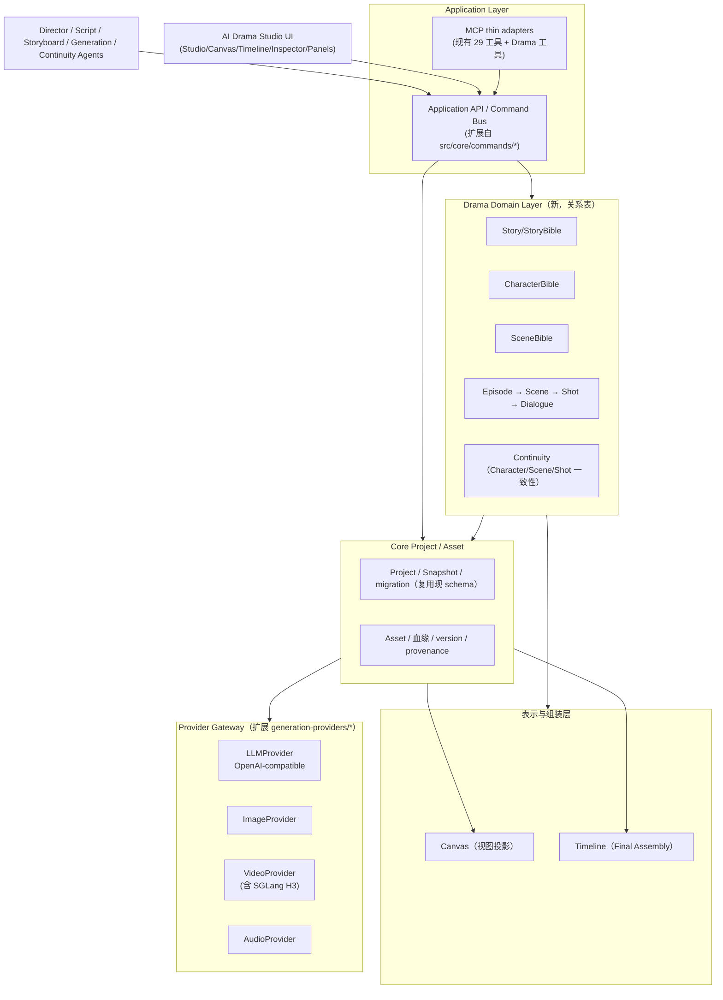

# BeatDesign → AI Drama Studio: 架构审计

> **文档状态**：`Audit Complete` — 本文仅做代码阅读、架构分析与文档输出。**未实施任何重构。**
> **审计日期**：2026-09-14　**基线 commit**：`21faad3`
> **方法**：完整阅读 `src/**`（376 个 TS/TSX 文件）、`docs/ARCHITECTURE.md`、`docs/MCP.md`、`docs/PROVIDERS.md`、`docs/PRODUCT_PLAN_AND_STATUS.md`、`package.json`、`LICENSE`、`third_party/` 授权声明。跨 8 个领域追踪数据流、依赖链与扩展点，随后对结论执行了一次独立对抗性架构评审（"Codex / GPT-5.6 Sol" 评审人）。
> **审计原则**：`可运行 > 可演进 > 可维护 > 架构优雅`。所有判断均引用具体文件/模块/函数/类型/schema；README 与代码不一致时以代码为准。

---

## 0. 执行摘要（Executive Summary）

> **BeatDesign 是否适合作为 AI Drama Studio 长期底座？**

**结论：适合，并且当前架构的质量明显高于一个"随手 fork 改 Logo"的基线。** 它已经具备一个 Agent-native Creative Studio 最昂贵的三块地基——**资产优先的领域模型、UI 与 Agent 共享的命令内核、可替换的 Provider 抽象**——而这三块恰好是长滩把"AI Canvas/Video Editor"演化为"AI 短剧制片工作室"的前提。直接保留的收益远大于重写的成本。

**主要依据（全部由代码证实）：**

1. **Asset-first 模型已经成立并且是事实标准。** 生成物生命周期是 `Generation → Asset（先落项目库）→ Canvas / Timeline 引用`，`generation-contract.ts` 的 `AssetFirstGenerationRequest v2` 明确"Generation 总是产出 Assets，placement 是后续命令"。这是 Drama Studio 最需要的产权模型：一个 `Shot` 产生的 storyboard/firstFrame/video 多个版本天然就是一批 Assets，Canvas/Timeline 只是视图。

2. **UI 与 MCP 共享同一个 Command Kernel，且 origin 被强制区分。** `src/core/commands/*`（envelope + 纯函数 executor + CAS 持久化 + 幂等回执 + 有界冲突重试）已经具备"应用服务总线"的雏形。未来 `Director Agent → Application API → Command Bus → Domain → Project State → Canvas/Timeline` 的目标架构，当前距离只有一个"Drama Domain 命令"的跨度（详见 §6/§8）。

3. **Provider 抽象已经分层，BeatAPI 耦合被明显收拢。** `generation-providers/registry.ts` 提供了 `GenerationProviderDefinition`（id / supports / modelBindings / createAdapter / assertConfigured / validateInput）+ 源码级扩展点 `config/generation-providers.ts`。但**大量实操耦合点依然存在**，其中最关键的是 `output-storage.ts` 只信任 `media.beatapi.io` 的 Media URL 才能落成项目 Asset（详见 §4/§5）。这些是 Phase 1 要处理的边界，不是推倒重来的理由。

4. **Canvas 与 Timeline 都已经是"领域对象的表示/组装层"，不是业务宿主。** Canvas 用 `referenceCardIds` 表达视觉连接、用 `generationSnapshot` 冻结单次运行参数；Timeline `timeline-document.ts` 全 grep 无任何 story/shot/scene/episode 字段。方向完全正确（§6 的边界判断）。**但存在一个反向的真实耦合**：`generation` 卡片**本身就是生成配置本体**（prompt/model/全部参数内联在 `CanvasCardBase`），且卡片模型是硬编码的 3-kind 闭联合集，无插件注册点——这是 Drama Domain 落地时必须隔离/重构的单一最大风险点。

5. **商业化/授权风险低。** Apache-2.0 主仓库、OpenReel(MIT) 固定 pin + Mediabunny(MPL-2.0) 依赖，均归档在 `third_party/`。依赖列表无 telemetry/PostHog/Sentry/分析 SDK。**不存在"不开 BeatAPI 就无法使用"的本地闭环模块**——本地导入、Canvas、Timeline、预览、MP4 导出（WebCodecs+Mediabunny）全部可离线运行（详见 §7）。

**一句话定性：** BeatDesign 适合作为长期底座，但要作为 AI Drama Studio 底座，**不能只加"Agent 一层"**；必须先处理三个结构性问题——(a) 把生成/卡片从 Canvas 闭联合集中解耦为一个通用卡片/领域注册机制，(b) 把 BeatAPI 媒体主机与上传路径从"asset 落库/输出存储"路径中抽离成 per-provider，(c) 用独立 Drama Domain Layer 承载 Story/Episode/Scene/Shot/Bible，并把 Canvas/Timeline 明确降为"表示层/最终组装层"。

---

## 1. 现状架构（Current Architecture，基于代码）

```mermaid
flowchart TB
    subgraph UI["React 19 + TanStack Start 前端（localhost）"]
        Home["Home / Projects<br/>src/routes"]
        Studio["Studio 引导<br/>src/routes/studio + studio-runtime.ts"]
        Canvas["Canvas<br/>React Flow (@xyflow/react)<br/>routes/canvas + beatcanvas/*"]
        Editor["Editor<br/>WebCodecs 预览/导出<br/>routes/editor + editor/*"]
        Assets["Assets<br/>routes/assets + workspace-lib/assets"]
    end

    subgraph API["Server API routes (Nitro)"]
        APICommands["/api/app/projects/:id/commands<br/>Command Kernel 写入口"]
        APISnapshot["/api/app/projects/:id/snapshot<br/>Canvas 全量快照 PUT"]
        APITimeline["/api/app/projects/:id/timeline<br/>Timeline 文档"]
        APIGenerate["/api/effects/generate|precheck|status|metadata"]
        APIConfig["/api/config/beatapi + storage"]
    end

    subgraph Kernel["Command Kernel<br/>src/core/commands/*"]
        Executor["executor.ts<br/>canvas.apply / editor.apply<br/>editor.replace_document / validate"]
        Persist["persist.ts<br/>CAS baseVersion + idempotency + in-flight lock"]
        Receipts["receipts.ts<br/>project_command_receipt 回执"]
        Conflict["conflict-retry.ts<br/>有界重放"]
    end

    subgraph Domain["领域服务层 src/core/*"]
        Project["projects/*<br/>project + snapshot CAS"]
        Effects["effects/*<br/>effect-registry, generation-orchestrator,<br/>submit-generation, generation-sync,<br/>output-storage, output-media"]
        Provider["generation-providers/*<br/>registry, contracts, beatapi-provider"]
        Adapters["adapters/*<br/>base-adapter, beatapi-adapter,<br/>mock-adapter, adapter-factory"]
        AssetsSvc["workspace-lib/assets/*<br/>user-assets, project-asset-membership"]
        SkillReg["skills/skill-registry.ts"]
    end

    subgraph MCP["MCP Server src/mcp/*"]
        Tools["29 tools:<br/>Skill2/Project5/Asset4/<br/>Canvas5/Generation5/Editor8"]
        Handoff["workspace-handoff.ts 浏览器交接"]
    end

    subgraph DB["Local SQLite (Drizzle, 12 表) + data/ 文件"]
        T["project<br/>project_canvas_state<br/>project_timeline_state<br/>project_command_receipt<br/>project_workflow_state<br/>generation_history<br/>generation_upload_intent<br/>generation_intent_upload<br/>asset<br/>generation_asset_link<br/>project_asset_membership<br/>config"]
    end

    subgraph Export["导出/渲染"]
        BrowserExport["media-export.ts<br/>WebCodecs + Mediabunny + Canvas2D"]
        NodeExport["render-project-timeline.ts<br/>ffmpeg/ffprobe (MCP bdesign_editor_render)"]
    end

    Beat["BeatAPI<br/>api.beatapi.io (/v1/images|videos|video-analysis/tasks)"]
    S3["R2/S3 存储 (可选)<br/>workspace-storage/*"]

    UI --> API
    Canvas -->|commands| APICommands
    Editor -->|commands| APICommands
    Assets --> APISnapshot
    MCP -->|origin=mcp, 同 Kernel| Executor
    APICommands --> Kernel
    Kernel --> Persist
    Kernel --> Executor
    Persist --> Domain
    Executor --> Project
    Executor --> Editor
    Effects --> Provider
    Provider --> Adapters
    Adapters -->|createGeneration/checkStatus| Beat
    Effects -->|upload| S3
    AssetsSvc --> DB
    Project --> DB
    Editor -->|browser| BrowserExport
    Editor -->|render| NodeExport
```



**真实架构要点（与 README/文档交叉核对，以代码为准）**

- **单一本地持久化底座**：一个 SQLite（`src/config/db/schema.sqlite.ts`，12 表）+ `data/` 项目媒体文件。`ARCHITECTURE.md:19` 声明"Studio/Canvas/Editor/Assets 是同一 Project 的视图"——代码证实（`workspace-modes.ts` 四种 mode 全部路由到同一 `$projectId`，共享 `projects.ts` / `user-assets.ts` / `generations`）。
- **两个持久化表面各自持有一份"权威文档"**：`project_canvas_state.document_json` 与 `project_timeline_state.document_json`（各自全量 JSON + 单调 version + CAS）。Asset/Generation 则独立关系表。这既是优点（surface—domain 分离）也是后续 Drama Domain 决策的关键参照（P4 争论点）。
- **Provider 存在"两套抽象层"并存**：新地址的 `generation-providers/registry.ts`（可扩展、多 provider）与旧地址的 `beatcanvas/providers/provider-config.ts`（`resolveBeatCanvasProviderId` **硬编码永远返回 `'beatapi'`**）。后者被 `beatapi-adapter.ts` 直接引用，是遗留单 Provider 假设的证据。

### 1.1 领域/模块清单（src/core 分组）

| 目录 | 责任 | 状态 |
|---|---|---|
| `src/core/commands/*` | 命令内核（envelope/executor/persist/receipts/conflict-retry/contracts/schema） | 成熟 |
| `src/core/adapters/*` | Provider 适配器抽象（base/beatapi/mock/adapter-factory） | 半健康（见 §5） |
| `src/core/generation-providers/*` | Provider 注册/契约/模型绑定 | 健康、可扩展 |
| `src/core/effects/*` | 生成编排、效果注册表、输出存储、生命周期、上传 intent | 半健康（BeatAPI 媒体门禁） |
| `src/core/beatcanvas/*` | Canvas 领域（composer/generation-runtime/generation-controller/providers） | 成熟但有耦合 |
| `src/core/editor/*` | Timeline 文档/状态/合并/字幕/诊断/导出 | 健康、纯组装层 |
| `src/core/media/*` | 媒体检查、抽帧、预览、PNG 编码 | 健康 |
| `src/core/projects/*` | 项目/快照/本地资产/导入/续帧 | 成熟 |
| `src/core/studio/*` | Studio 引导 runtime/历史**格式化** | 极薄（`studio-history.ts` 只是日期/比例工具） |
| `src/core/workspace-storage/*` | R2/S3 上传端点 | 健康、可配置 |
| `src/core/workspace-lib/*` | DB 适配、资产服务、模型图标、App API 客户端 | 健康 |
| `src/mcp/*` | MCP Server + 29 工具 + 浏览器交接 | 成熟但扩展点差（见 §6） |
| `src/core/skills/*` | Skill 目录 loader | 就绪但目录为空 |

---

## 2. 关键数据流（Critical Data Flows）

### 2.1 Generation 数据流

```text
UI (Studio/Canvas)─────────────┐
MCP bdesign_generation_submit──┘
        │  AssetFirstGenerationRequest v2 (generation-contract.ts)
        ▼
/api/effects/generate ────────▶ normalizeAssetFirstGenerationRequest
        │                       compileAssetFirstGenerationInput (asset→delivery URL, reference authorization)
        ▼
submitEffectGeneration (submit-generation.ts)
        │  security: prompt validation → upload intent admission (consumeGenerationUploadIntent, withGenerationSubmissionLock)
        │  recordGeneration(status:pending) → generation_history 行
        ▼
createAdapter(effect).createGeneration(input)   ← adapter-factory 按 effect.provider 路由
        │
        ▼
BeatApiAdapter.buildBeatApiTaskRequest → POST /v1/{images,videos,video-analysis}/tasks
        │  resolveGenerationSubmitTransition (orchestrator) → pending/processing/succeeded
        ▼
persistEffectOutputIfNeeded (output-storage.ts)
        │  ★ 仅当 URL host == media.beatapi.io (isOfficialBeatApiMediaUrl) 才下载落库
        │  recordUserAsset(source:provider, assetClass:generated) → asset + generation_asset_link(role:output)
        ▼
updateGenerationById  →  若仍在跑：startBackendPollingForGeneration → server-poller → syncGeneration → adapter.checkStatus
```

### 2.2 Asset 数据流

```text
生成/上传/派生
   │ recordUserAsset (user-assets.ts)：type/source(上传|provider|derived)/assetClass(original|generated|derived)
   │            bucket/objectKey/publicUrl/sha256/width/height/durationMs/metadata(json)
   ▼
asset 表 ──▶ generation_asset_link(role: input|output|thumbnail)  ←─ Generation 血缘（真实派生）
   │
   ├─▶ project_asset_membership(category: upload|reference|generated|cover, slotId/role/workflowType/metadata) ──▶ 项目归属
   ├─▶ Canvas asset card（assetId/url 引用）
   └─▶ Timeline clip（assetId 锁定，takes[] 提供备选版本 → activeTakeId 激活）
```

### 2.3 Canvas 数据流

```text
UI 拖拽/缩放/连接 ──▶ recordCanvasHistory(undoStackRef, ≤50 全量快照, 仅浏览器本地)
        │  350ms 防抖 / 5s 检查点 / pagehide 冲刷 → PUT /snapshot
        ▼
canvas.apply (增量 op) ──▶ executor.applyCanvasOperations → 全量 ProjectSnapshotDocument(version CAS)
                                   saveProjectSnapshot → project_canvas_state
        ▲
        │ referenceCardIds 生成 edges（视觉连接，非血缘）
        │ sourceConfigCardId / sourceGenerationId 记录真实派生
MCP canvas.apply ──▶ (origin=mcp) 同一 executor + persist，有界冲突重放
```

### 2.4 Timeline 数据流

```text
editor.apply (add_clip/trim/split/move/ripple/add_overlay/add_take/upsert_caption/import_srt)
        │ normalizeCommandAssetReferences (asset-boundary.ts) → assetId → 服务端权威 publicUrl
        ▼
executor.applyEditorOperations → 全量 TimelineDocument → saveProjectTimeline(version CAS) → project_timeline_state
        │ syncExistingTimelineCanvasCard → 更新 Canvas 上的 timeline:<id> 卡片
        ▼
浏览器预览/导出：media-export.ts (WebCodecs+Canvas2D+OfflineAudioContext) → 前端 MP4
        │
MCP 权威导出：render-project-timeline.ts (ffmpeg/ffprobe) → project Asset，写回 Canvas 卡片
```

### 2.5 Export 数据流

```text
[浏览器] exportTimelineMp4 (media-export.ts:385) → CanvasSource(canvas) + captions + overlays + OfflineAudioContext 混音
        → Encoder/Mediabunny mux → Blob MP4. 离线可用，零 FFmpeg 依赖。
[MCP/Node] renderProjectTimelineToAsset (render-project-timeline.ts:397) → ffmpeg/ffprobe(PATH 或 BEATDESIGN_FFMPEG/_FFPROBE)
        → project Asset。★ 与 BeatAPI 无任何耦合。
```

### 2.6 MCP → Command → Persistence 数据流

```text
bdesign_canvas_apply / bdesign_editor_edit
        │ executeExternalCommand (mcp/server.ts:229) 强制 origin='mcp'
        ▼
persistExternalCommandWithConflictRetry (conflict-retry.ts:39)
        ▼
persistBeatDesignCommand (persist.ts:346)  idempotencyKey 去重 + expectedRevision CAS
        ▼
executeBeatDesignCommand (executor.ts)  → 纯函数应用 ops
        ▼
saveProjectSnapshot / saveProjectTimeline → SQLite（CAS baseVersion）
        ▼
storeCommandReceipt (project_command_receipt, TTL 24h/2000)
        └─ agent 结果可见：页面每 2s 轮询 revision / 聚焦检查（无实时事件总线）
```

---

## 3. 模块评估表（Module Assessment）

判定 `KEEP / EXTEND / WRAP / REFACTOR / REMOVE-REPLACE`。优先级：P0=立即，P1=Phase1，P2=Phase2，P3=Phase3+。

| Module | Current Responsibility | Coupling | Decision | Reason | Migration Priority |
|---|---|---|---|---|---|
| `src/core/commands/*`（命令内核） | Canvas/Editor 统一写入口，origin 隔离、幂等、CAS、冲突重试 | 低（纯函数 + 文档 in/out） | **KEEP / REFACTOR（注册制）** | 已是"应用命令总线"雏形；**不要**用"扩大闭联合集"扩展（评审否决）；改为 `commandType` 键控的 handler 注册表，Application API 与 MCP 工具都从它**生成**；域命令针对关系行做行级 revision，而非文档 CAS | **P0** |
| `src/core/generation-providers/*` | Provider 定义/注册/模型绑定 | 低（可扩展 registry） | **KEEP / EXTEND** | 保留 `GenerationProviderDefinition`+源码注册点；补 LLM/audio 能力 | P0 |
| `src/core/adapters/base-adapter.ts` | 适配器抽象（createGeneration/checkStatus/estimateCost） | 低 | **KEEP / EXTEND** | 抽象正确；扩展为 provider 可声明"产出 media host 白名单" | P0 |
| `src/core/adapters/beatapi-adapter.ts` | BeatAPI 协议映射（/v1/*/tasks 请求构造 + 结果归一化） | 强（BeatAPI 专用） | **WRAP**（保留）/ 内部视为 Vendor | 作为**一个** provider 实现保留，但不要让它做全局契约；协议细节收进 adapter | P0 |
| `src/core/effects/output-storage.ts` | 生成媒体→本地 Asset 下载落库 | **强 BeatAPI：只信任 media.beatapi.io** | **REFACTOR** | 把 `isOfficialBeatApiMediaUrl` 门禁改为 per-provider "approved media host"能力；多 provider 的关键阻塞 | **P0** |
| `src/core/effects/beatapi-media-url.ts` | 官方媒体主机白名单 + SSRF 防护 | 强 BeatAPI 主机 | **WRAP** | 把"approved host"与 SSRF 防护拆开；SSRF 防护保留为通用 | **P0** |
| `src/core/effects/beatapi-model-contract.ts` | 每模型参考上限/上传路径（逻辑 ID） | 中（逻辑但 BeatAPI 命名） | **WRAP** | 移入 provider 自身 contract，摆脱全局 BeatAPI 命名 | P1 |
| `src/core/effects/submit-generation.ts` / `generation-sync.ts` / `server-poller.ts` | 生成编排、状态同步、轮询 | 低（经 adapter） | **KEEP / EXTEND** | 已 Provider 无关；补 job 抽象与 per-provider polling 契约 | P1 |
| `src/core/effects/effect-registry.ts` + `workspace-models.ts` | 用户可见逻辑模型目录 / model option | 中（硬编码 BeatAPI effectId 数值） | **EXTEND（WRAP）** | `modelId` 逻辑化好，但 `effectId` 数值残留于 DB 行；新 provider 需避免复用数值 effectId 语义 | P1 |
| `src/core/beatcanvas/*`（Card 模型 + controller） | Canvas 卡片（asset/generation/output 闭联合集）| **中高：generation 卡片即生成配置本体** | **REFACTOR（隔离）** | Drama 落地前把卡片从"3-kind 闭联合集"改为"通用卡片 + kind 注册"或把业务配置移到领域实体 | P1 |
| `src/core/beatcanvas/providers/provider-config.ts` | 单 Provider 配置 | 强死耦合（永远返回 'beatapi'） | **REPLACE（收敛）** | 与 generation-providers registry 合并/废弃 | P2 |
| `src/core/editor/*` | Timeline 文档/状态/字幕/诊断/导出 | 低（纯组装层，无 story 字段） | **KEEP / EXTEND** | 保持 final-assembly；新增 add_track/移动轨道/voice-BGM-SFX 轨道/每集 timeline | P2 |
| `src/core/media/*` | 媒体检查/抽帧/PNG | 低 | **KEEP** | 本地、良好 | P3 |
| `src/core/projects/*` | 项目/快照/本地资产/导入 | 低 | **KEEP / EXTEND** | 作为 Drama 容器；新增 registerProjectGenerationProviders 兼容 | P1 |
| `src/core/workspace-lib/assets/*` | Asset 关系服务 | 低 | **KEEP / EXTEND** | 补充 parentAsset/version/provenance 字段 | P1 |
| `src/core/studio/*` | Studio 引导 | 低 | **KEEP**（薄） | 无需动 | P3 |
| `src/core/workspace-storage/*` | R2/S3 上传 | 低 | **KEEP**（可选可配置） | 保留 BYOK 存储 | P3 |
| `src/mcp/*` | MCP 29 工具 + 27 交接 | 中（工具硬编码注册 + Codex 交接拼接） | **EXTEND（WRAP→通用注册）** | 引入声明式 tool/domain 命令注册；抽离 Codex 专用交接参数 | P2 |
| `src/core/skills/skill-registry.ts` | Skill 目录 loader | 低 | **KEEP / EXTEND** | 未来 Drama Workflow 的直接宿主 | P2 |
| `src/lib/*`（crypto/trusted-local-request/rate-limit/resp）| 安全/工具 | 低 | **KEEP** | 保留 | — |
| `src/routes/api/effects/*` `commands.ts` `snapshot.ts` `timeline.ts` | HTTP 薄壳 | 低 | **KEEP** | 薄壳，无需重构 | — |
| `integrations/*`（Codex/Claude/WorkBuddy/等 17 宿主打包） | 各宿主安装层 | 中（打包层） | **KEEP / WRAP** | 都是本地 localhost 应用的可选安装层，非第二套后端 | P3 |
| `third_party/`（OpenReel/Mediabunny 授权归档） | 授权声明 | — | **KEEP** | 合规 | — |

---

## 4. BeatAPI 耦合分析（具体文件与调用链）

### 4.1 分层定性

将 generation 相关依赖按 `A 已抽象良好 / B 轻度耦合可 Adapter / C 强耦合需重构 / D BeatAPI 专用可删除` 分类：

| 分类 | 模块 | 说明 |
|---|---|---|
| **A 已抽象良好** | `generation-providers/registry.ts`、`contracts.ts`、`adapter-factory.ts`、`submit-generation.ts`、`generation-sync.ts`、`server-poller.ts`、`generation-orchestrator.ts`、`generation-contract.ts`(asset-first) | 已经 provider 无关；按 `effect.provider` 路由 |
| **B 轻度耦合** | `effect-registry.ts`（`modelId` 逻辑化）、`workspace-models.ts`、`beatapi-model-contract.ts`（逻辑但命名）| 逻辑模型在，但 `effectId` 数值 / BeatAPI 命名残留 |
| **C 强耦合** | **`output-storage.ts`（媒体主机门禁）**、`beatapi-media-url.ts`（approved host）、`beatapi-input-upload.ts`（默认上传路径 `POST /v1/files`）、`adapters/beatapi-adapter.ts`（协议细节）| 需要把"approved media host / upload path / 协议"变成 per-provider 契约 |
| **D BeatAPI 专用可删除/隔离** | `beatcanvas/providers/provider-config.ts`（硬编码单 provider）、`effects/beatapi-catalog-sync*.ts`（BeatAPI 模型目录同步）、`effects/beatapi-media-url.ts` 的 media.beatapi.io 硬 host | 与多 provider 目标冲突 |

### 4.2 最关键的隐藏耦合：Asset 落库媒体主机门禁

```text
persistEffectOutputIfNeeded (output-storage.ts:112)
   └─ isOfficialBeatApiMediaUrl(url)  // beatapi-media-url.ts:68  host === 'media.beatapi.io' 且 https
        └─ 不通过 => 该生成媒体不会成分的本地 Asset（会被丢弃或抛错）
```

**后果**：任何返回自有 CDN/Bucket 域名的 LLM/Image/Video Provider 都会在"把输出落成项目 Asset"这一步被拒。这正是"asset-first 本地持久化 = 事实标准"路径上**最大的单点 BeatAPI 绑定**。多 Provider 化的最小改动就是把"approved media host"声明在 provider 定义上（类似现有 `imageBucketName` 的扩展），SSRF 防护逻辑（`isPublicHttpMediaUrl` + 私网黑名单）保留为通用。

### 4.3 上传链路调用链

```text
precheck → upload intent (generation_upload_intent / generation_intent_upload)
   └─ 默认路径：POST /v1/files（BeatAPI Files）
   └─ 可选：用户自有 R2/S3（workspace-storage/*）
   └─ asset-first 提交前把 iv 引用按 provider 上传（beatapi-input-upload.ts ensureMotionControlInputUrls 等）
```

**判断**：上传路径已按 provider/storage 分叉到一定程度（BeatAPI 或自建 bucket），但对"reference delivery"仍是按 BeatAPI 字段写死的。接入通用 LLM/Image/Video Provider 时需把 `reference-delivery.ts` 的契约扩展为 provider 声明上传方式（BeatAPI Files / 自有 bucket / 直接 public URL）。

---

## 5. Provider 扩展分析（最小接入路径）

### 5.1 目标抽象（概念模型，非现目录）

```ts
interface GenerationProvider {              // 或拆成 LLM/Image/Video/Audio
  id: string;
  capabilities: ('image'|'video'|'analysis'|'llm'|'audio')[];
  modelBindings: GenerationProviderModelBinding[];
  createAdapter(effect: EffectRecord): BaseAdapter;
  assertConfigured?(): Promise<void>;
  validateInput?(effect, input): void;
}
// GenerationRequest → GenerationService → ProviderRegistry → Provider → Remote/Local API
```

**关键认知**：BeatDesign **不应**另起一套"Provider Gateway"；应**扩展并重构**现有的 `generation-providers/*` + `BaseAdapter`。真正要做的是：
1. 给 `GenerationProviderDefinition` 增加 `mediaHostAllowlist?: string[]`（用于 output-storage 落库门禁）。
2. 给 `GenerationMediaCapability` 增加 `'llm'`（以及需要时 `'audio'` 的"生成"语义，而非仅 reference）。
3. 把硬编码的 `effectId`（BeatAPI 数值）从 generation_history 的"业务外键"降级为 provider 私有元数据；逻辑 `modelId` 成为主键。

### 5.2 OpenAI-compatible LLM（DeepSeek / GLM）最小路径

```text
1. 新 adapter 类（LLMAdapter extends BaseAdapter, implements createGeneration/checkStatus(str 协议 /chat/completions))
2. 在 src/config/generation-providers.ts：registerProjectGenerationProviders(r => r.register({id:'openai', ...})) + ACTIVE_GENERATION_PROVIDER_ID（可测性保留 beatapi）
3. capability='llm' 加入 effect-registry / workspace-models 目录
4. （若需 LLM 文本回写）新增 Drama 域命令/工具消费文本结果，降为 asset(output text) 或直接域字段
```
改动集中在：`src/core/adapters/openai-llm-adapter.ts`(新) + `config/generation-providers.ts` + `effect-registry.ts` + `contracts.ts`(capability 枚举)。

### 5.3 Image Provider（Qwen Image / OpenAI Image）最小路径

```text
1. 新 adapter（/v1/images/generations 之类），实现 createGeneration + checkStatus 或 sync
2. 注册 provider + modelBinding(modelId 'qwen-image' | 'gpt-image', upstreamModelId)
3. ★ output-storage/beatapi-media-url：把"approved media host"改为读 provider.mediaHostAllowlist（否则输出无法落库）
4. effect-registry 增加目录项（可选已有象 gpt-image-2 复用到非 BeatAPI 上 model）
```

### 5.4 SGLang MiniMax H3（POST /v1/videos）最小路径

```text
1. 新 adapter（callPostVideosAdapter）：
   - createGeneration → POST {model:'minimax-h3', prompt, ...} 到 SGLang /v1/videos；返回 GenerationResult
   - 视 SGLang 是否异步：同步 return succeeded / 或实现 checkStatus（GET task）按具体情况
2. registry 注册 minimax provider（supports:['video'], modelBinding minimax-h3 → upstream 'minimax-h3'）
3. effect-registry：minimax-h3 已存在（id 'minimax-h3'），绑到新 provider 的 binding 即可
4. output-storage：provider.mediaHostAllowlist = ['<sglang-host or its bucket>'] 放行落库
```

**最小接入 Path 结论**：不涉及 Canvas、Editor、MCP 请求、asset-first 契约——因为那层已经是逻辑 modelId 驱动。**唯一必须同时改动**的是 `output-storage.ts` 的媒体主机门禁（P0）与 `config/generation-providers.ts` 的注册点。这正印证 AGENTS.md 所述"forks may add a provider through source-level extension points without changing Canvas, Editor, MCP"——但**该承诺目前被 output-storage/beatapi-media-url 的硬编码 host 门禁破坏**。

---

## 6. Drama Domain Integration Strategy（如何进入而不污染 Canvas / Timeline）

### 6.1 目标原则

```
Configure State ≠ Business Domain State
Timeline ≤ Final Assembly
```

### 6.2 推荐数据边界

- **Drama Domain（Story/Episode/Scene/Shot/Bible/Dialogue）进入 `Project` 下的新域表**（Drizzle + 现有 `drizzle/sqlite/` 迁移机制，已存在 0000..0003），**不是新数据库**。Project 成为真正容器。
- **Canvas 只负责 Drama 对象的可视化表示**：Shots/Characters/Scenes 等以"视图卡片"投影到 Canvas，而非成为 Canvas Card 的业务本体。`CanvasCard` 是"领域对象 → canvas 表示"的薄投影。
- **Timeline 只负责最终媒体编排**：一个 `Shot` 的选定 video/firstFrame/storyboard/audio 最终物化为 Timeline 上的 clip 及其 takes，Timeline 本身不存 shot 语义。Shot → 生成视频 → Timeline liner 通过"把 Shot 选中的 Asset 以 add_clip 放入对应 Episode/Scene 的 timeline"这一命令桥接。

### 6.3 关键架构决策：Drama Domain 用关系表还是第三份"权威文档"？

这是本审计最重要的分歧点，经对抗性评审确认后给出**确定结论**：

| 选择 | 优点 | 缺点 | 建议 |
|---|---|---|---|
| **A. Drama Domain 使用关系表（drama_\* 表）** | 与 Asset/Generation 天然 join 血缘；Agent 高频增量写由行级事务解决；**避免第三份全量文档快照再造"snapshot-per-surface"病**；selection/version 可类型化 | 需新 schema + 迁移；与 Canvas/Timeline 文档式持久化不一致 | **确定采用（评审确认，否决方案 B）** |
| B. 第三份 `project_drama_state` 全量文档快照 | 与现有持久化范式一致 | **复制了"每表面一份全量文档"的既有病灶**；每写整文档 CAS+重放；Shot/Bible 高写频；域命令与文档 in/out 错配 | **否决**（评审明确否决） |

**结论**：Drama Domain 用**关系表**承载，Canvas/Timeline 保持现有文档快照表示。域命令走"自己的命令注册表 + 行级 revision"，**复用** commands 的 receipts/CAS/conflict-retry 基建（机制复用，命令语义独立）。避免把 Drama 全量态塞进第三份文档。

### 6.4 数据归属表（推荐，评审修正版）

```text
Project
 ├── (关系表 drama_*) StoryBible / CharacterBible / SceneBible / Script
 │   ├── Episode → Scene → Shot → Dialogue
 │   ├── shot_asset(shot_id, asset_id, role, version, provenance)   ← 类型化 join，NOT asset 上的一个外键
 │   │      role ∈ {storyboard, first_frame, video, audio, reference}; version = 可推导序号，不存列;
 │   │      provenance 记录 provider/generationRun/parameters
 │   └── Shot 行上的可变选择指针：shot.videoAssetId / shot.firstFrameAssetId / shot.selectedOutputId
 │         （selection = 指向不可变 asset 行的指针，而非在 asset 上打"selected"布尔）
 ├── (文档快照) Canvas = 表示层  (project_canvas_state)
 └── (文档快照) Timeline = 最终组装  (project_timeline_state, assemblyScope 见 §11 P6)
```

**要点**（来自评审 P4/P5 修正）：Asset 行**不可变** + 血缘靠 join；role/version 必须**类型化**（`shot_asset` 表），不要塞进 `metadata(json)`；"选中的结果"是 Shot 上的可变指针，不是 asset 上的 flag；同一任务的 `1 task → N 输出`（如一次生成同时产出 firstFrame + video）用多行 `shot_asset` role link 表达。

### 6.5 Canvas Card Union 的处理（唯一高风险）

Canvas audit 表明：`generation`/`asset` 卡片即业务对象本体，且是硬 3-kind 闭联合集 + 无注册点。为避免"Drama 业务写进 Canvas Node"，**不要在第 1 阶段就把 Character/Shot 塞进 `canvasCardUnion`**。两条路径，倾向后者：

- **路径 A（短期，低风险）**：Drama Domain 落在关系表 + 自身命令；Canvas 通过薄"doma→card view projection"暴露只读/投影卡片（不持业务配置）。保留现有 3-kind union 不动。
- **路径 B（中长期）**：把卡片模型改为"`kind: string` + 通用 `data` 字典 + 卡片 kind 注册表（validate/create/render/persist/migrate）"，从闭联合集演进为可扩展注册。这是**真正的重构**（需动 types/schema/normalizer/repair/DB/React Flow 节点联合），应在 Drama 卡片需求真实出现时做，而非现在。

**本审计建议**：Phase 1 **不引入 Drama 卡片类型**；先让 Drama 域命令 + 关系表 + Canvas 投影视角工作。把"卡片注册表"列为 P1 的可选重构，避免早期过度设计。

---

## 7. 依赖与商业化风险

### 7.1 授权

- 主仓库 **Apache-2.0**（`LICENSE`）。依赖全部为 permissive/MIT/ISC/Apache/BSD。
- `third_party/` 归档：**OpenReel**（MIT，pin `5f3c85e`，只用术语/文档模型/非破坏编辑，未打包其外壳）、**Mediabunny**（MPL-2.0，`1.25.3` 精确 pin，浏览器媒体复用）。授权完整合从。

### 7.2 商业化耦合分类

| 类别 | 依赖 | 判断 |
|---|---|---|
| **Must Keep** | TanStack/React/Drizzle/@libsql/mediabunny/@xyflow/Mediabunny/zod/paraglide/base-ui | 核心、本地、无厂商锁定 |
| **Replaceable** | `@aws-sdk/client-s3`/`s3mini`（可选 R2/S3 存储） | 仅当用自建上传时；本地导入不依赖 |
| **Should Replace / WRAP** | `@aws-sdk`（重型）| 可选；`s3mini` 轻量替代已存在 |
| **Remove** | — | 无 telemetry/analytics/PostHog/Sentry/支付/订阅依赖 |

### 7.3 SaaS lock-in / "不开 BeatAPI 就无法使用"

- **本地闭环完全成立**：本地导入、Canvas、Timeline 编辑、预览、浏览器 MP4 导出（WebCodecs+Mediabunny）均无需 API key。`ARCHITECTURE.md:31` 与代码一致。所有"必须 BeatAPI"的动作都被限制为"远程生成/分析/AI redo"。
- **风险集中点**：`output-storage.ts` 把"生成输出落成本地 Asset"绑定 BeatAPI 媒体主机；以及默认 `ACTIVE_GENERATION_PROVIDER_ID='beatapi'`。这是**结构性**而非产品层面的锁定——换 provider 即可解除，但需要 §5 的改动。
- 无 hosted-service 依赖；SQLite + `data/` 完全本地。
- **商业授权/品牌风险**：产品名 `AI Drama Studio` 与 BeatAPI 命名无直接冲突；但 fork 后若保留 BeatAPI 品牌图标/模型名（`Lobe HappyHorse` 等），应确认品牌使用边界。`TRADEMARKS.md` 存在。属法务审查范畴，非代码问题。

---

## 8. Agent 架构推荐

### 8.1 两种方式对比

| | Agent → MCP（直接） | Agent → Application API/Command → Domain |
|---|---|---|
| 现状 | 已实现（29 工具，origin='mcp' 强隔离，幂等/CAS/重试） | 部分实现（命令内核已经是 application bus，但只覆盖 Canvas+Editor） |
| 优点 | 立即可用、宿主无关核心 | 稳定契约、可作 SDK、Domain 演进不破坏 MCP 工具名 |
| 缺点 | 工具硬编码注册、无撤销、Codex 交接拼接 | 需额外抽象层 |

### 8.2 长期推荐

```
Director-Agent / Script-Agent / Storyboard-Agent / Generation-Agent / Continuity-Agent
        │
        ▼
   MCP 层（thin adapters，仅协议进出）── 现在已存在
        │
        ▼
   Application API / Command Bus（稳定、版本化、Drama 域命令扩展）── 现在 = commands/*，需扩展 Drama 变体
        │
        ▼
   Domain（story/scene/shot/bible …）
        │
        ▼
   Core Project / Asset
        │
        ▼
   Canvas / Timeline（表示/组装，自动响应 revision）
```

**当前距离**：命令内核已具备 envelope/幂等/CAS/冲突重试/版本 check，使命与 UI 一致。缺三样：(1) Drama 域命令（用 `commandType` 键控的 **handler 注册表**承载，而非扩大闭联合集）；(2) 把 Project/Asset/Generation 从 MCP server 里"直接调用服务"改成也走命令总线，且 **MCP 工具/A 应用 API 由注册表 schema 生成**，取代逐工具手写 `registerTool`；(3) 稳定的 Application API，与 MCP 工具命名解耦。

**关于撤销**：评审修正——Agent 写入不进入 browser-local undo 栈的问题，**不要靠把 React refs 迁进命令层**解决；应在命令总线加 **op-log/checkpoint**（每次命令追加可逆记录/检查点），由总线负责 Agent 侧可撤销。这应定为 P1 数据丢失风险项。

---

## 9. 未来目标架构（Future Target Architecture）



**修正（相对任务的理想图）**：理想图把"Provider Gateway"画在最底层、承接所有生成。**按代码实情，应把 Provider 收在 `generation-providers/*` 的扩展点上**，且不另起独立微服务；Canvas 在目标架构里从"节点即业务"降为"视图投影"；Timeline 保持纯组装。Agent 层之上叠 Drama Domain。

---

## 10. Upstream Fork Strategy（特别检查）

面向"AI Drama Studio"的长期 fork（不长期无脑跟 BeatDesign upstream），核心目标不是"少改每个文件"，而是**分区：让不改的分支保持纯净、让必改的分支允许重度分歧**，并控制合并成本。基于本审计的真实扩展点与硬联结点，划分如下：

### 10.1 Vendor Layer（尽量少改，保持 upstream-compatible，靠扩展点）

这些是 BeatDesign 的不变量核心，**应保持"扩展点纯净、正文尽量不动"**，以降低回同步成本：

- **Provider 抽象**：`generation-providers/registry.ts`、`contracts.ts`、`BaseAdapter`、`adapter-factory.ts`。已有源码扩展点（`config/generation-providers.ts` `registerProjectGenerationProviders`）。尽量不改其正文。
- **命令信封/持久化机制**：`commands/contracts.ts`、`receipts.ts`、`conflict-retry.ts`、`persist.ts`（CAS/idempotency/conflict 是 invariant）。域命令应**新注册表**承载，不改这些机制本体。
- **本地媒体/导出**：`media/*`、`editor/media-export.ts`（WebCodecs+Mediabunny）、`workspace-storage/*`。纯本地。
- **安全/基础**：`lib/crypto.ts`、`lib/trusted-local-request.ts`、`lib/rate-limit.ts`、`config/data-root.ts`。
- **Skill loader**：`skills/skill-registry.ts`（用 filesystem catalog 扩展新 Skill）。
- **授权归档**：`third_party/*`（OpenReel/Mediabunny）。

### 10.2 Our Product Layer（应重度 fork，接受分歧）

这些是 Drama 产品化的"自己地盘"，**不要被 upstream 合并舒适束缚**：

- **Drama Domain**（`src/core/drama/*` + 关系表 schema）——纯新增，upstream 无此物，不发散冲突。
- **Canvas 卡片注册/域投影**（若做路径 B：把 3-kind 闭联合集改为注册制）——会与 upstream 的 `canvas-types.ts`/`schema.ts`/`project-snapshot.ts` 冲突。**决策**：若 Ballad 需要，属 diverged-surface，接受 schema 冲突，不维护 v-shim。
- **MCP 工具注册 + 交接**（声明式注册表 + 移除 Codex 硬编码）——diverged。
- **`output-storage.ts` / `beatapi-media-url.ts` 媒体主机门禁 per-provider** ——此文件被 upstream 改动频率可能高且与我们的多 provider 目标直接冲突；**决策**：作为 diverged-surface 管理，必要时抄送 upstream 的安全修复。
- **`effectId` schema / 目录源**（`effect-registry.ts`、`beatapi-catalog-sync*`）——diverged（provider 中立化）。

### 10.3 控制合并成本的具体措施

1. **维护一份 `UPSTREAM.md` divergence matrix**：列出"哪些上游文件我们改了、为什么、期望的回同步策略（security-only / always / never）"。
2. **回同步只做安全修复 + 不变量**（`lib/*`、pinning、依赖 override），对 diverged-surface 的上游改动选择性 cherry-pick。
3. **扩展点优先于改正文**：新能力优先走 registry（provider / skill / card-kind future），而非在 vendor 文件里 if-else。
4. **不建 v-shim/adapter 层"只为日后好合并"**——评审明确否决：那只是放大维护面。diverged 就是 diverged。

### 10.4 应避免直接修改的核心文件（保持 upstream-compatible 强相关）

- `src/core/generation-providers/registry.ts`、`contracts.ts`
- `src/core/commands/contracts.ts`、`receipts.ts`、`conflict-retry.ts`、`persist.ts`
- `src/lib/crypto.ts`、`trusted-local-request.ts`
- `src/core/media/*`、`editor/media-export.ts`
- `package.json` 主依赖与 `pnpm-workspace.yaml` 的构建策略

---

## 11. 技术债与风险（Technical Debt / Risks）

| 优先级 | 项 | 证据 | 影响 |
|---|---|---|---|
| **P0** | 输出媒体"approved host"硬编码 `media.beatapi.io`，阻塞多 provider | `output-storage.ts:140-141` `beatapi-media-url.ts:68` `isOfficialBeatApiModelName` | 新 Image/Video/LLM provider 内容无法落成本地 Asset，asset-first 承诺断裂 |
| **P0** | Canvas `generation` 卡片即生成配置本体 + 3-kind 闭联合集无注册点 | `canvas-types.ts:88-109` `schema.ts:146-176` `project-snapshot.ts:170-172` `beatcanvas-react-flow-types.ts:14-17` | Drama 卡片/业务若想进入 Canvas 将被 4-5 处硬编码联合锁死；Drama 业务易侵入 Canvas Node |
| **P0** | Agent 写入不可撤销（undo 栈是浏览器本地且不含 MCP 写入） | `use-beatcanvas-react-flow-adapter.ts:508-555` vs `persist.ts` | 违反"Agent 操作可撤销可验证"，阻碍 Agent-driven 产品 |
| P1 | 命令内核只覆盖 Canvas+Timeline；Project/Asset/Generation 未入总线 | `executor.ts:25-29` | 外部 Agent 无法以统一语义写 Project/Asset/Generation/未来的 Drama 域 |
| P1 | MCP 工具逐一手写注册、无声明式 catalog | `src/mcp/server.ts:317` `tools.ts:1-31` | 新增 Drama 工具成本高、易漂移 |
| P1 | `effectId`（BeatAPI 数值）渗入 DB 行作为业务外键 | `schema.sqlite.ts:102` `record-generation.ts:44` | provider 切换后数值语义混乱 |
| P1 | 双 Provider 抽象并存（`generation-providers` vs `beatcanvas/providers/provider-config.ts` 硬编码） | `generation-providers/registry.ts` vs `beatcanvas/providers/provider-config.ts:44-46` | provider 选择逻辑分裂 |
| P1 | `studio-history.ts` 命名误导（不是 history 存储） | `src/core/studio/studio-history.ts` | 未来维护者误以为有 undo 存储 |
| P2 | Timeline 单 projectId PK、无 add_track / move_clip_to_track、audio 仅单轨 | `timeline-document.ts:91-103` `editor-commands.ts` `schema.sqlite.ts:236-249` | 每集/voice-BGM-SFX/多语言字幕受限制 |
| P2 | 真多视频 A/B（多画面同时合成）未实现 | `media-export.ts:501-507`（单块视觉） | 高级镜头对比受限 |
| P2 | 无实时事件总线，UI 靠 2s revision 轮询 | `use-project-snapshot-lifecycle.ts:481-552` MCP.md:226 | Agent 操作可见延迟 |
| P2 | Codex 专用浏览器交接拼接在 workspace-handoff | `workspace-handoff.ts:62-91` | 非 Codex 宿主 get 到 Codex 参数；品牌/可移植性 |
| P3 | Skill 目录为空 | `skills/official/` 仅 README | 未来 Drama Workflow 宿主尚未有内容 |
| P3 | `@aws-sdk/client-s3` 重依赖（可选） | `package.json` | 若只本地无需国外，可减 |
| P1 | `%` 与"系统 FFmpeg"。 `render-project-timeline.ts` 无系统 FFmpeg 时需用户提供（Browser 导出不依赖） | MCP.md:187-191 | 桌面端产品话将需内嵌 ffmpeg |

---

## 12. 对抗性评审结论（Adversarial Review Summary）

独立评审人（"Codex / GPT-5.6 Sol"角色，无仓库访问，纯对抗性压力测试）对本审计 P1–P8/C1–C3 逐条判定。已并入正文的**决定性修正**：

- **P1/P7（关键）**：**否决"扩大 Canvas|Editor|Drama 闭联合集"**——union + dispatcher switch 的增长不是可扩展性。改为 **`commandType` 键控的 handler 注册表**，Application API 与 MCP 工具都由注册表的 `schema()` **生成**。域命令针对关系行做**行级 revision**，不是文档 CAS。这是"性价比最高、最便宜的改动"，评审将其提升为 C1 #2。
- **P3**：确认 `output-storage` 媒体主机门禁是"sepsis"——**先单独修这一个**（per-provider 可信主机 allowlist）。但指出两处过/欠设计：(a) **LLM 是薄客户端，不是第 4 套 Provider 接口**；(b) 第二个提供商（SGLang `/v1/videos`）比"加一个 adapter"大很多——它是 completion 型（无 task 轮询），数值 `effectId` + BeatAPI 形目录不匹配，需**预算 schema 迁移**（`effectId → providerId+providerModelRef`）+ sync-vs-task 抽象 + 独立目录源。
- **P4/P5**：**否决第三份全量文档 CAS**（drama）；Canvas+Timeline 两份文档已养出"每表面全量快照"病灶，第三份会复制它。域数据用关系表；role/version 类型化到 `shot_asset` join，**不塞 metadata(json)**；version=可推导序号不存列；selection=**Shot 上的可变指针**，不是不可变 asset 上的 flag；**复用 Timeline `takes[]`** 表达备选。遗漏风险：`1 task → N 输出` / regeneration → firstFrame+video 需 N 行 role link。
- **P6**：多视频 A/B **不属于 Timeline**（是 shot-selection）；把单 `projectId` PK 换成 `assemblyScope(episodeId|sceneId|shotId|null)` 可空 FK → 单表支持每场景 liner；v1 项目级组装可接受；Timeline 上**不加 story 字段**。
- **P7**：声明式命令/tool 注册是最高杠杆；"Agent 编辑不可撤销"是 **P1 数据丢失风险**，用**总线 op-log/checkpoint** 修，不要移植 React refs；Codex 交接拼接是抽象错误信号，handoff 应做注册表。
- **P8**：**"最小化每个文件的 upstream churn"是错误框架**。对产品 pivot 应**分区**：invariant-core（媒体 provider 注册、asset、本地存储、命令 envelope——保持扩展点纯净）vs diverged-surface（域、canvas、MCP 工具、schema——接受重度 fork）。**只回同步安全修复与 invariants**，靠一份 **divergence matrix（UPSTREAM.md）** 跟踪；不要造 v-shim 去"方便日后合并"。
- **C1（最终排序）**：(1) 媒体主机门禁单独先修；(2) 声明式命令/tool 注册；(3) Drama Domain（先只做 schema 证明，slice 先行）——"域不污染 canvas/timeline"是**原则/验收**，不是一次性特旨功能。
- **C2（minimal slice）**：Script→Director LLM(薄客户端)→Shot 对象 + 单条 `shot.generate` 命令路由 BeatAPI + **恰好一个 completion 型 provider**（强制真多 provider）+ 输出本地化 + Shot 卡片 + takes[] 落 timeline。Bible/characters/voice/per-episode/深度 undo 延后。
- **C3**：无代码级 IP landmine（Apache-2.0 署名 + 品牌卫生即可，勿暗示 BeatAPI 背书）；真实问题在产品策略：默认 BeatAPI 耦合=隐私/供应链披露；"AI Drama Studio" 商标需检索（拥挤赛道）；低成本重命名 BeatAPI 命名内部项以清品牌。

### Top 5 Traps（评审）

1. **"把 union 扩大当作扩展"** → 杀掉；用 handler 注册表。
2. **媒体主机门禁是 sepsis** → 单独、最先修。
3. **第二个 provider 比"一个 adapter"大**（completion 型、schema effectId、目录）；**LLM 也别做成第 4 套接口**。
4. **不做第三份全量 CAS 文档**；域数据用关系；version≠列、selection≠不可变行上的 flag。
5. **"最小化 upstream churn"对 pivot 是错的** → 分区 invariant-core vs diverged + divergence matrix + 只回同步安全/不变量。

初未见的场景补记：**Timeline 升级为"每集 / multi-timeline"会触碰 schema（单 projectId PK）**，评审建议用 `assemblyScope` 可空 FK 演进，而非在 Timeline 文档里塞集号。

---

## 13. 迁移路线图（Migration Roadmap，渐进式，非整版重写）

按审计修正后的阶段（不再机械采用任务预设，改为"每阶段有一可验证的可见闭环"）：

### Phase 0 — Baseline（先行确认原版能力健康）
- `pnpm typecheck && pnpm test && pnpm i18n:check && pnpm build` 全绿。
- 浏览器 + MCP 关键路径冒烟（Canvas→Editor→导出写回）。

### Phase 1 — Decouple Providers 与 Asset 落库（最高优先，P0）
- **★ 第一步：单独修媒体主机门禁**（sepsis 优先）：`output-storage.ts` + `beatapi-media-url.ts`："approved media host"改为 per-provider allowlist；SSRF 防护保留通用。
- `base-adapter.ts` / `GenerationProviderDefinition` 增加 `mediaHostAllowlist`。
- `config/generation-providers.ts`：演示注册一个非 BeatAPI provider，验证 `ACTIVE_GENERATION_PROVIDER_ID` 切换不破坏 Canvas/Editor/MCP/asset-first（回归**必须**有测试）。
- **★ 命令注册制（评审最高杠杆、C1 #2）**：把 Canvas/Editor 命令从"闭联合集 + switch"演进为 `commandType` 键控的 **handler 注册表**，MCP 工具由其 `schema()` **生成**。这是为域命令铺路、且自身就是回本最快的改动。
- 抽出 `effectId` 数值语义：DB 行主键改为逻辑 `modelId` + providerId（迁移）——第二个 provider 需要，评审确认需预算。
- **不碰**：Canvas/Timeline 文档模型结构、UI 品牌。

### Phase 2 — Domain Foundation（Drama Domain，P1）
- **域用关系表，否决第三份文档 CAS**。新增 `src/core/drama/` 目录（episode/scene/shot/bible/dialogue 关系表），走现有 drizzle/drizzle-kit 迁移。
- 域命令走 Phase 1 的 **handler 注册表**（`drama.*`），对关系行做**行级 revision**，复用 commands 的 receipts/conflict-retry 机制。
- asset 归属用**类型化 `shot_asset(shotId, assetId, role, version, provenance)` join**；selection=Shot 上的可变指针；Canvas 仅薄投影，**不新增硬卡片类型**。
- **改动文件**：`src/config/db/schema.sqlite.ts`（新表）、`src/core/drama/*`（新）、命令注册表（新）。

### Phase 3 — Generation Workflow（Shot → Image → Video）
- 域命令驱动 `shot.generate` → firstFrame/storyboard/video 生成，产物统一为带 provenance 的 Assets（`shot_asset` role link + shot 指针）。
- 接入 OpenAI-compatible LLM（**薄客户端，不是第 4 套 Provider 接口**）与 **恰好一个 completion 型 Video Provider**（SGLang H3 `/v1/videos`），强制验证真多 provider + 输出落库。
- exporter（浏览器/Node）保持现状不动。

### Phase 4 — Agent Layer
- MCP 工具由命令注册表 schema 生成（撤销逐工具 `registerTool`）；移除 workspace-handoff 里的 Codex 硬编码参数（handoff 做注册/可配置）。
- **Agent 撤销**：在命令总线加 **op-log/checkpoint**（每次命令追加可逆记录/检查点），由总线负责 Agent 侧撤销（**不移植 React refs**）。
- 提供稳定 Application API，与 MCP 工具命名解耦。

### Phase 5 — Continuity
- 基于 Drama Domain 的 Character/Scene/Shot 一致性服务（把 bible/asset 引用注入 provider 输入契约），复用统一 Provider Registry。

**每阶段验收**：以"一个可运行的可见闭环"为准（如 Phase1=一个非 BeatAPI provider 产出可落库 Asset + 命令注册表生成 MCP 工具；Phase3=一次 shot.generate 从 prompt 到选定 video 出现在 Timeline）。

---

## 14. Audit Complete — 决策清单

### 14.1 最应立即处理的 3 个架构问题
1. **P0 — 输出媒体主机门禁**：`output-storage.ts` + `beatapi-media-url.ts` 硬编码 `media.beatapi.io`，是"多 Provider + asset-first 落库"的阻断点。必须先改为 per-provider allowlist。
2. **P0 — Canvas 卡片闭联合集与"generation 卡片即配置本体"**：作为 Drama 落地前必处理；至少为"域→canvas 投影"隔离，并为卡片注册制(路径 B)做预案，避免 Drama 业务写进 Canvas Node。
3. **P0 — Agent 写入不可撤销**：undo 栈是 browser-local 且不入 MCP 写入，违反"Agent 操作可撤销可验证"；需在命令层补逆操作/版本恢复。

### 14.2 最值得保留的 5 个 BeatDesign 核心模块
1. **`src/core/commands/*`（命令内核）** — UI/Agent 共享、幂等+CAS+冲突重试，是 Application Bus 的地基。
2. **`src/core/generation-providers/*`（Provider 注册/契约）** — 已可扩展，是 Provider Gateway 的现成载体。
3. **`src/core/editor/*`（Timeline 纯组装层）** — 无 story 耦合、导出全本地、能力健康（字幕/Overlay/Take）。
4. **`src/core/media/*` + 浏览器导出**（WebCodecs+Mediabunny）— 可离线、无 FFmpeg 依赖的核心查看/交付。
5. **Asset-first `AssetFirstGenerationRequest v2` + `generation_history`/`generation_asset_link` 血缘** — 多版本/provenance 的现成基础。

### 14.3 第一阶段实际应修改的文件/模块范围
- `src/core/effects/output-storage.ts`、`src/core/effects/beatapi-media-url.ts`（媒体主机门禁 per-provider）。
- `src/core/adapters/base-adapter.ts`、`src/core/generation-providers/contracts.ts`（`mediaHostAllowlist` + `capability` 枚举扩展）。
- `src/config/generation-providers.ts`（注册点演示第二 provider；可保留 beatapi 默认）。
- `src/core/generation-providers/beatapi-provider.ts`（为 BeatAPI 声明 media host allowlist）。
- 可选：`src/config/db/schema.sqlite.ts` + drizzle 迁移（effectId 降级 / 新增 provider 元数据）。
- 测试：`output-storage.test.ts`、`registry.test.ts`、`provider-config.test.ts` 的回归新增。

### 14.4 第一阶段明确不应该碰的模块
- **不改 Canvas 卡片联合 / `canvas-types.ts` / `schema.ts` / `project-snapshot.ts`**（除非做路径 B 的重构，否则不引入 Drama 卡片类型）。
- **不改 Timeline 文档模型 / Editor 命令结构**（Phase 1 无需，P2 再做 add_track/multi-timeline）。
- **不改 UI 品牌 / 页面 / Home**。
- **不引入 Drama 关系表/域表**（Phase 2 再做）。
- **不实装 LLM/Image/Video 全套 Provider**（Phase 1 只做"可注册 + 可落库"的最小验证）。
- **不加登录 / billing / 微服务 / 订阅 / RBAC**（范畴外）。
- **不动 `package.json` 主依赖与技术栈**。

### 14.5 开始 AI Drama Studio Phase 1 前需做出的架构决策
1. **Drama Domain 用关系表（已定）** —— 域数据用 `drama_*` 关系表，**否决第三份全量文档 CAS**；Canvas/Timeline 保持文档快照表示；域命令走 handler 注册表 + 行级 revision，复用 commands 的 receipts/conflict-retry。
2. **命令模型：能否立即从闭联合集/switch 改为 `commandType` handler 注册表**（评审最高杠杆）——决定域命令与 MCP 工具生成方式；建议 Phase 1 就做。
3. **Provider Gateway 复用 `generation-providers`，不新建独立网关**（已定）——避免重复；LLM 作为薄客户端并入，不做第 4 套 Provider 接口。
4. **Agent 撤销：op-log/checkpoint 落在命令总线，不移植 browser-local React refs**（已定）——决定 Agent"可撤销"履约方式。
5. **`effectId` 数值是否从 DB 主键语义移除（provider 中立化）** —— 决定多 provider 共存时历史数据如何迁移；第二个 provider 需此预算。
6. **Domain 数据所有权：`shot_asset(shotId, assetId, role, version, provenance)` 类型化 join + Shot 行上的可变 selection 指针，不塞 asset 行 metadata(json)（已定）** —— 血缘/连续性查询与写入路径。

---

*审计完成（Audit Complete）。本轮未做任何重构。所有"可运行"能力应另行 `pnpm typecheck / test / i18n:check / build` 验证后再承诺。*